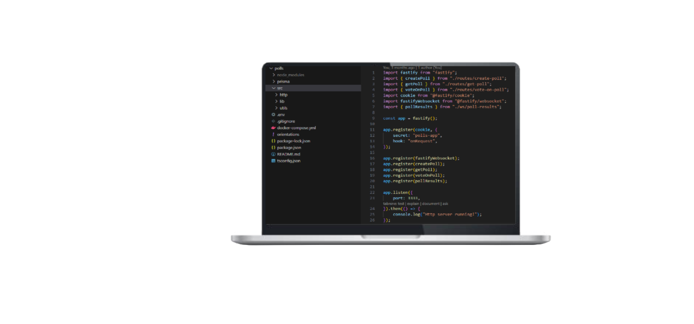

<h1 align="center">
  Polls
</h1>

  

## ✨ Tecnologias

Esse projeto foi desenvolvido com as seguintes tecnologias:

- [TypeScript](https://www.typescriptlang.org/)
- [Fastify](https://fastify.dev)
- [Docker](https://www.docker.com)
- [Prisma](https://www.prisma.io)

## 💻 Projeto

O Polls é um app que permite criar e votar nas diferentes opções de cada enquete.

## 🚀 Como executar

- Clone o repositório
- Instale as dependências com `npm install`
- Inicie os serviços com `docker-compose up`
- Inicie o servidor com `npm run dev`

Agora você pode acessar [`localhost:3333`](http://localhost:3333) do seu navegador.

---
